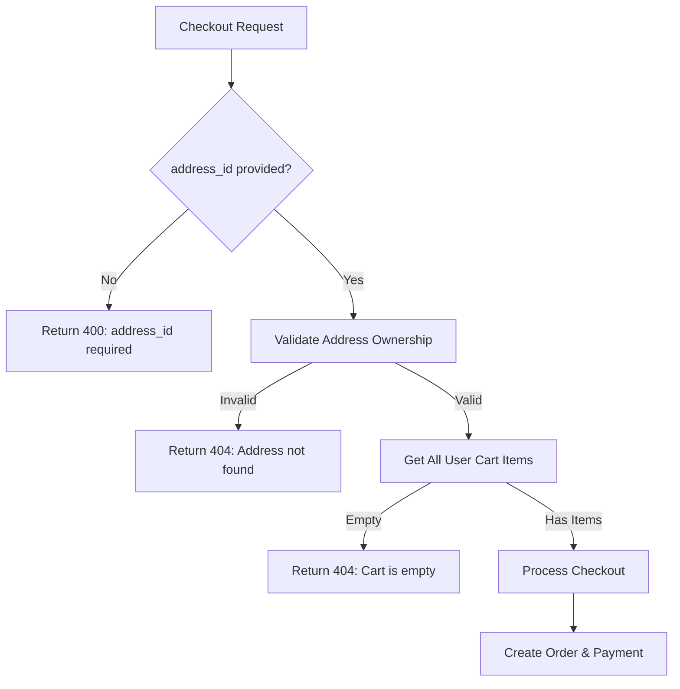

# Checkout API Validation Examples

## Security Validations

The checkout API processes ALL cart items for the authenticated user and includes address ownership validation.

### 1. Address Ownership Validation

**Scenario**: User A tries to use User B's address

```json
// Request from User A (ID: 123)
{
    "address_id": 789  // This address belongs to User B (ID: 124)
}
```

**Response**:
```json
{
    "error": "Address not found or does not belong to user"
}
```
**Status Code**: 404 Not Found

### 2. Empty Cart Validation

**Scenario**: User A tries to checkout with no cart items

```json
// Request from User A (ID: 123) - User has no items in cart
{
    "address_id": 456  // Valid address belonging to User A
}
```

**Response**:
```json
{
    "error": "Cart is empty"
}
```
**Status Code**: 404 Not Found

### 3. Valid Request Example

**Scenario**: User A checkouts all their cart items

```json
// Request from User A (ID: 123)
{
    "address_id": 789  // Address belongs to User A
}
```

**Response**:
```json
{
    "success": true,
    "order_id": 101,
    "redirect_url": "https://mercury.phonepe.com/transact/...",
    "message": "Order created successfully"
}
```
**Status Code**: 201 Created

**Process**:
- Fetches ALL cart items belonging to User A
- Validates address belongs to User A
- Creates order with all cart items
- Clears all processed cart items

## Validation Flow



## Database Security

### User Isolation
- All queries include `user=request.user` filter
- Prevents cross-user data access
- Ensures data privacy and security

### Example Queries

```python
# Address validation
address = Address.objects.get(id=address_id, user=request.user)

# Cart items (all user items)
cart = Cart.objects.filter(user=request.user).first()
cart_items = cart.items.all()
```

## Error Handling Priority

1. **Authentication**: 401 Unauthorized (if no valid token)
2. **Missing address_id**: 400 Bad Request
3. **Invalid address**: 404 Not Found
4. **Empty cart**: 404 Not Found
5. **Payment failure**: 500 Internal Server Error

## Best Practices

### Frontend Implementation
```javascript
// Validate user has items in cart and valid address
const userAddresses = await fetchUserAddresses();
const userCartItems = await fetchUserCartItems();

if (userCartItems.length === 0) {
    alert('Your cart is empty');
    return;
}

// Send checkout request with user's address
const checkoutData = {
    address_id: userAddresses[0].id  // Verified user address
};
```

### Backend Security
- Never trust client-provided IDs without validation
- Always filter by authenticated user
- Use database constraints to prevent data inconsistency
- Log security violations for monitoring

## Testing Scenarios

### Unit Tests
1. Valid user with valid address and cart items
2. Valid user with invalid address
3. Valid user with empty cart
4. Valid user with multiple cart items

### Integration Tests
1. Cross-user access attempts
2. Payment gateway integration
3. Database transaction rollback on failure
4. Cart cleanup after successful order
